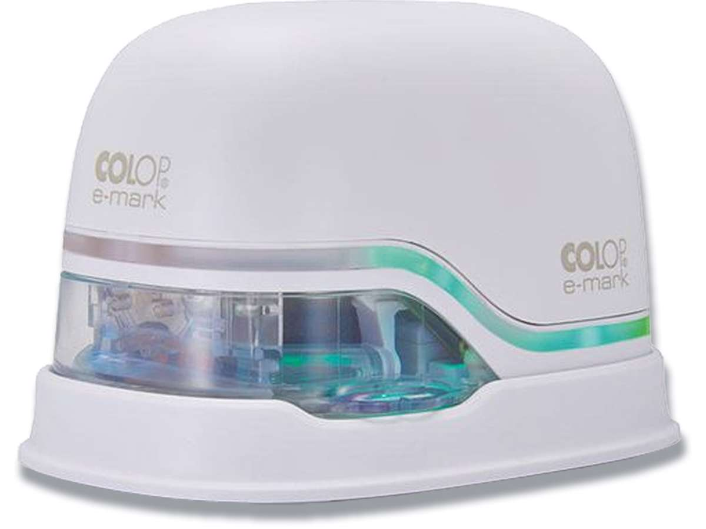

# Colop Jet Ink Printer

## Table of Contents
- [Printer Overview](#printer-overview)
- [App for Printer](#app-for-printer)
- [Templates](#templates)
- [Guide to Templates](#guide-to-templates)
- [Brugsanvisning](#brugsanvisning)
  - [Materialer](#materialer)

## Printer Overview

Printeren ser sådan ud:

## App for Printer

[Hent appen for at kunne bruge printeren](https://www.colop.com/en_eur/mobile-printing/the-e-mark/app-software)

## Templates

[Templates](https://www.colop.com/en_eur/mobile-printing/the-e-mark/templates)

## Guide to Templates

[Guide til templates](https://colop-emark.zendesk.com/hc/en-150/articles/6064143568669-How-can-I-use-the-additional-templates-from-the-website)

## Brugsanvisning

Maskinen er meget simpel, dog er der nogle aspekter man SKAL overholde:

- Sæt printeren straks tilbage ind i docken når den ikke er i brug!
- Pres ikke for hårdt og bevæg printeren langsomt for at få det bedste resultat.

Inden brug, kan der være behov for at gøre printerhovedet ren - strejf blæk-udløsningsmekanismen med et stykke fugtig papir eller klud (følg retningen). 

### Materialer

Colop e-mark bruger inkjet-teknologi med en tre-farvet (CMY) blækpatron, så den kan printe direkte på de fleste absorberende overflader, fx **papir**, **karton**, ubehandlet **træ**, **kork** og **stof**.
