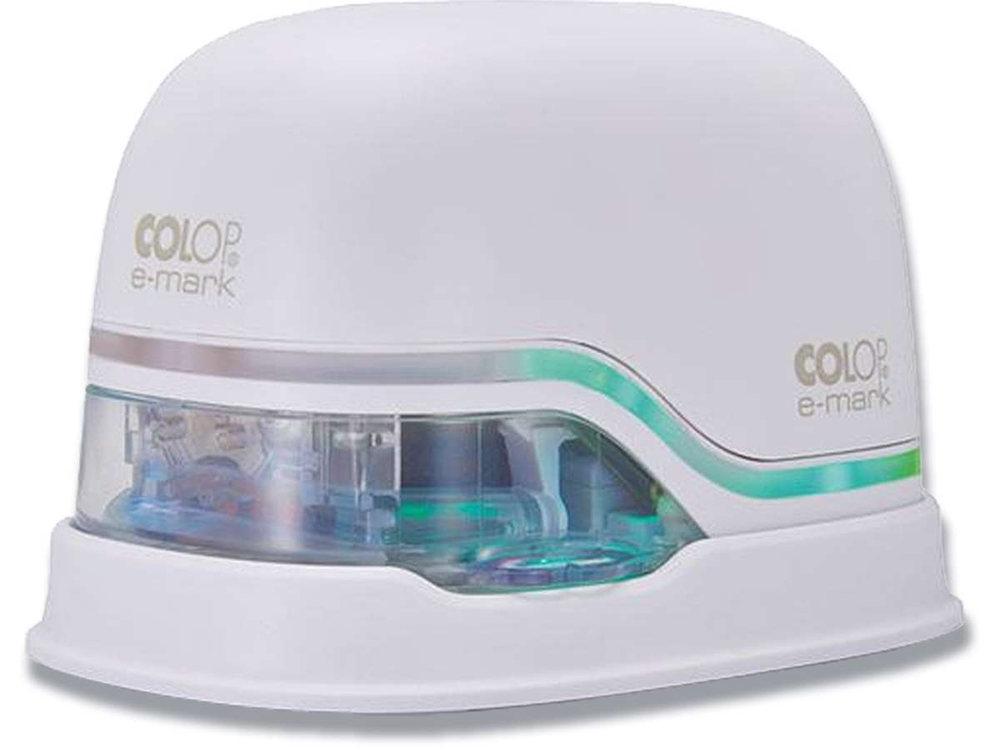

# Colop Jet Ink Printer

## Table of Contents
- [Printer Overview](#printer-overview)
- [App for Printer](#app-for-printer)
- [Templates](#templates)
- [Guide to Templates](#guide-to-templates)
- [Brugsanvisning](#brugsanvisning)
  - [Materialer](#materialer)

## Printer Overview

Printeren ser sådan ud:

## App for Printer

[Hent appen for at kunne bruge printeren](https://www.colop.com/en_eur/mobile-printing/the-e-mark/app-software)

## Templates

[Templates](https://www.colop.com/en_eur/mobile-printing/the-e-mark/templates)

## Guide to Templates

[Guide til templates](https://colop-emark.zendesk.com/hc/en-150/articles/6064143568669-How-can-I-use-the-additional-templates-from-the-website)

## Brugsanvisning

Start med at downloade appen. Når du åbner den, bliver du bedt om at indtaste SSID og password. Det er printerens netværksoplysninger, som du finder på siden af trækassen, hvor printeren ligger.
Når det er indtastet, er forbindelsen oprettet.
Printeren mister desværre hurtigt strøm, så den skal ofte oplades, før den kan bruges. Den kan oplade både når den er tændt og slukket.

#### Vigtigt

Maskinen er meget simpel i brug, dog er der et par ting man SKAL overholde:

- Sæt printeren straks tilbage ind i docken når den ikke er i brug!
- Pres ikke for hårdt og bevæg printeren langsomt for at få det bedste resultat.

Inden brug, kan der være behov for at gøre printerhovedet ren - strejf blæk-udløsningsmekanismen med et stykke fugtig papir eller klud (følg retningen). Alternativt, er der en "quick-cleaning" funktion inde i appen (settings -> e-mark device).

### Materialer

Colop e-mark bruger inkjet-teknologi med en tre-farvet (CMY) blækpatron, så den kan printe direkte på de fleste absorberende overflader, fx **papir**, **karton**, ubehandlet **træ**, **kork** og **stof**.
